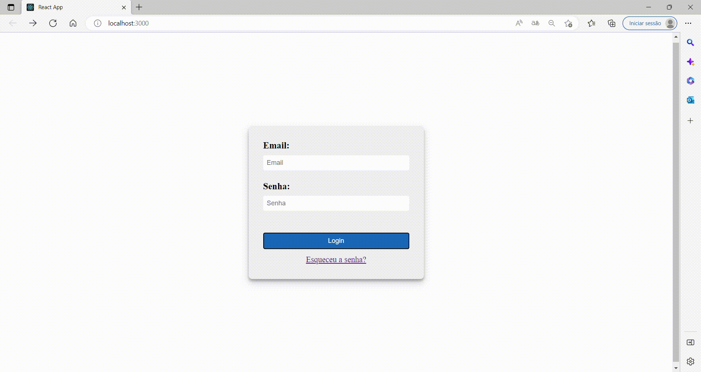

### 💻React DOM Router

In this project, I used React to create two pages: login and password recovery. I connected them using React Router, which uses components to represent routes and has a <BrowserRouter> component to manage URL changes. The React Router is fundamental for navigating React apps and routes are the supported URLs.

#### What was developed:

- Responsive css;
- React DOM Router using npm or yarn package manager.
- Import the components: In your JavaScript file, import the React DOM Router components you need, such as <Router>, <Link>, and <Route>.
- Create Routes: Define routes to your application's pages using the <Route> component.
- Add the <Router> component: Add the <Router> component to the root of your application and send its routes as child components.
- Creating links between pages: Use the <Link> component to create links between pages in your application

  
 

<h1 align="center">

</h1>

### 🧪 Tools

Application developed using the following tools:

- [HTML5](https://www.w3schools.com/html/default.asp)
- [CSS3](https://www.w3schools.com/css/default.asp)
- [React](https://reactjs.org/)
